# Operationalizing Machine Learning

## Project Overview
In this project, we will work with the Bank Marketing dataset. We will use Azure to configure a cloud-based machine learning production model, deploy it, and consume it. We will also create, publish, and consume a pipeline.

In this project, we will following the below steps:

- Authentication
- Automated ML Experiment
- Deploy the best model
- Enable logging
- Swagger Documentation
- Consume model endpoints
- Create and publish a pipeline
- Documentation

## Architectural Diagram
The following diagram is an image that helps visualize the flow of operations from start to finish. An architectual diagram of the project :

## Key Steps

### Step 1: Authentication

In this step, we will install the Azure Machine Learning Extension which allows you to interact with Azure Machine Learning Studio, part of the az command. After having the Azure machine Learning Extension, we will create a Service Principal account and associate it with our specific workspace.

### Step 2: Automated ML Experiment

At this point, security is enabled and authentication is completed. In this step, we will create an experiment using Automated ML, configure a compute cluster, and use that cluster to run the experiment. We will upload the bankmarketing_train.csv to Azure Machine Learning Studio so that it can be used when training the model. Data link to download : https://automlsamplenotebookdata.blob.core.windows.net/automl-sample-notebook-data/bankmarketing_train.csv

In following image, we can see that the Bankmarketing dataset is available as “Registered Datasets” in ML Studio. 

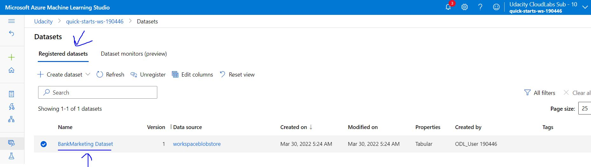

In following image, we can see that the AutoML process is shown as completed.

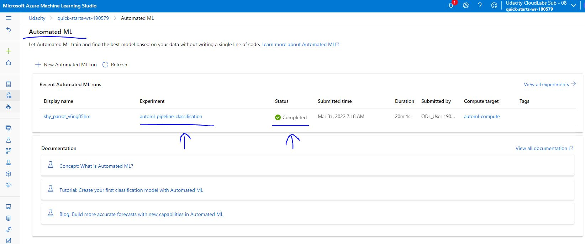

In following image, we can see that the experiment used for AutoML is shown as completed.

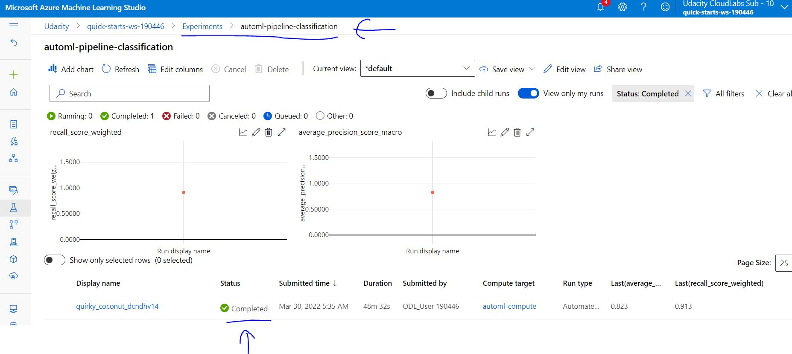

### Step 3: Deploy the Best Model

After the experiment run completes, a summary of all the models and their metrics are shown, including explanations. The Best Model will be shown in the Details tab. In the Models tab, it will come up first (at the top). Select the best model for deployment. Deploying the Best Model will allow to interact with the HTTP API service and interact with the model by sending data over POST requests.

In following image, we can see thatt : AutoML Best model

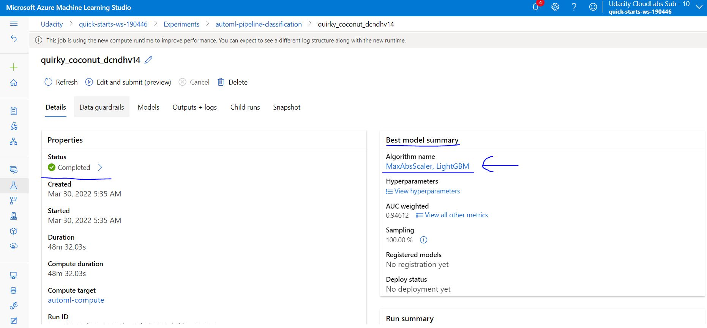

### Step 4: Enable Application Insights

We choose the best model for deployment and enable "Authentication" while deploying the model using Azure Container Instance (ACI). The executed code in logs.py enables Application Insights. "Application Insights enabled" is disabled before executing logs.py. Although this is configurable at deploy time with a check-box, it is useful to be able to run code that will enable it.

In following image, we can see that : Application insights

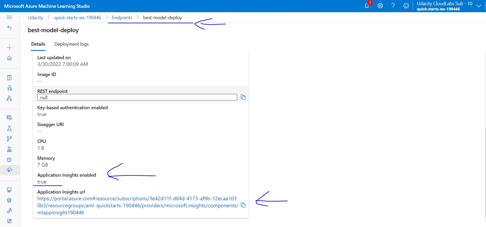

In following image, we can see that : Logs

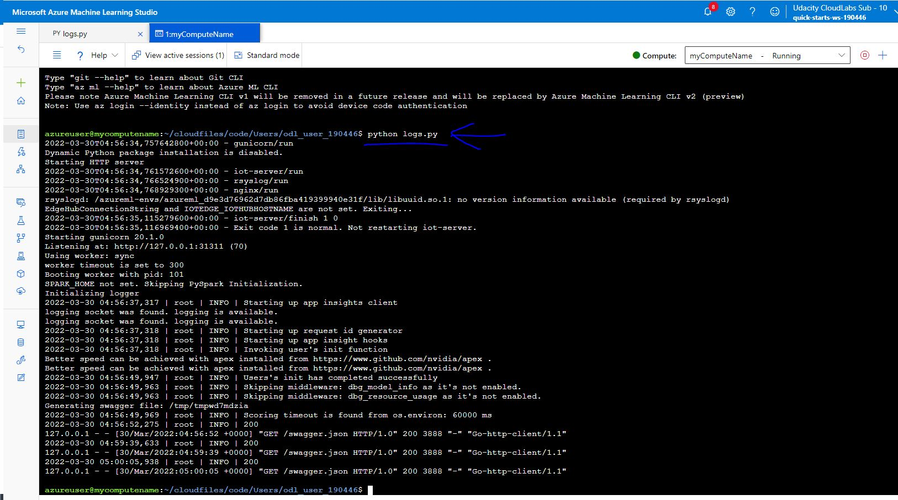

### Step 5: Swagger Documentation

In this step, we will consume the deployed model using Swagger. Azure provides a Swagger JSON file for deployed models. Head to the Endpoints section, and find deployed model there, it should be the first one on the list.

In following image, we can see that : Swagger documentation

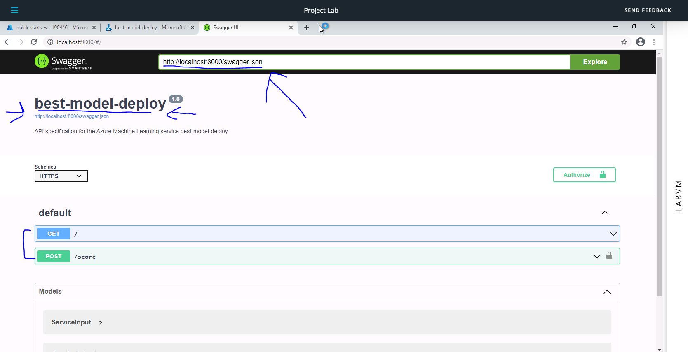

In following image, we can see that : Swagger get responses

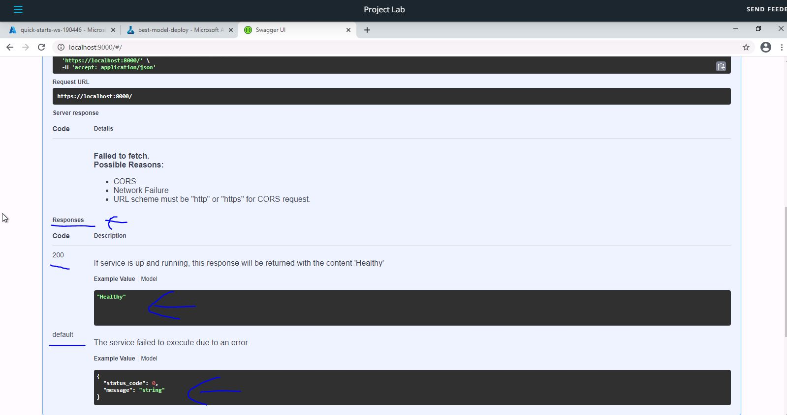

In following image, we can see that : Swagger post responses

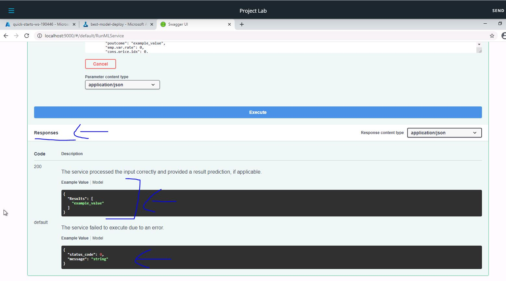

### Step 6: Consume Model Endpoints

Once the model is deployed, use the endpoint.py script to interact with the trained model. In this step, we need to run the script, modifying both the scoring_uri and the key to match the key for service and the URI that was generated after deployment. This URI can be found in the Details tab, above the Swagger URI.

In following image, we can see that : Endpoint output

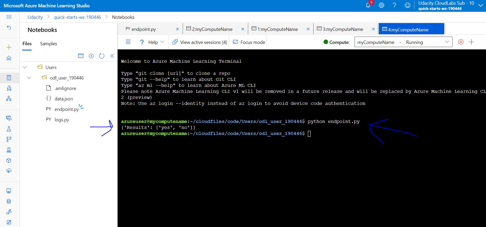

### Step 7: Create, Publish and Consume a Pipeline

For this part of the project, we will use the Jupyter Notebook. We must make sure to update the notebook to have the same keys, URI, dataset, cluster, and model names already created.

In following image, we can see that : Pipeline runs

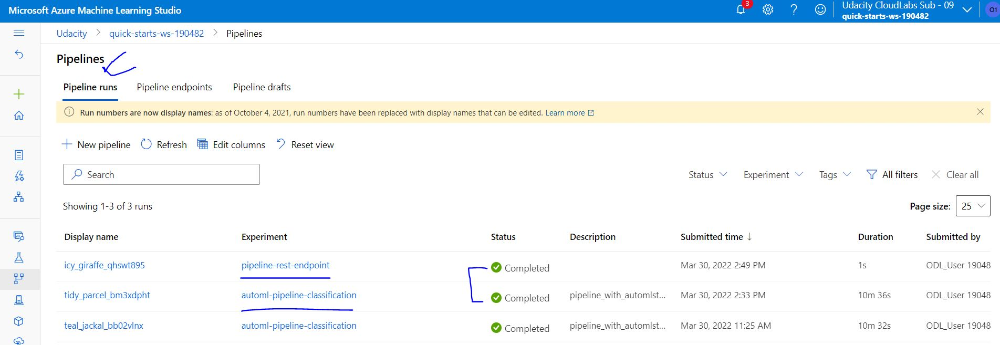

In following image, we can see that : Pipeline run overview

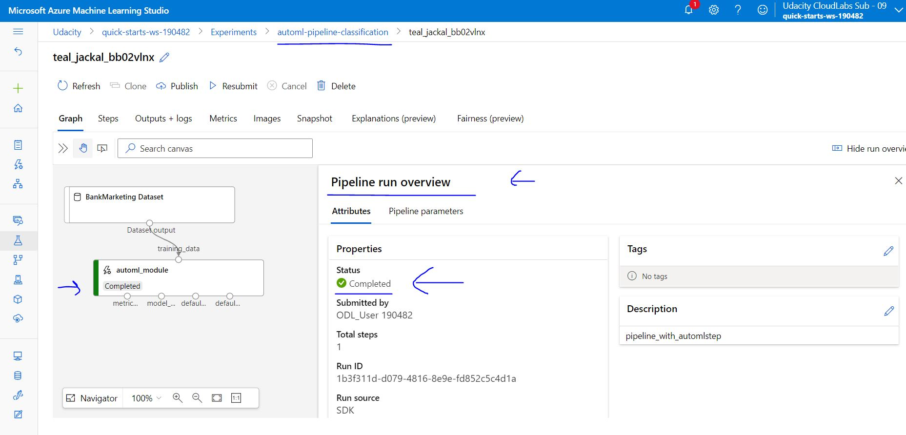

In following image, we can see that : Pipeline endpoint

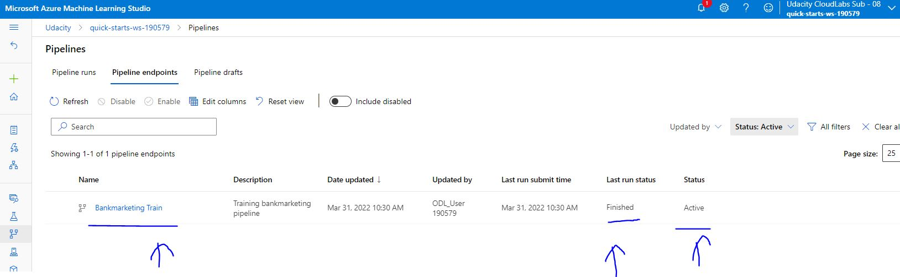

In following image, we can see that : Pipeline run details

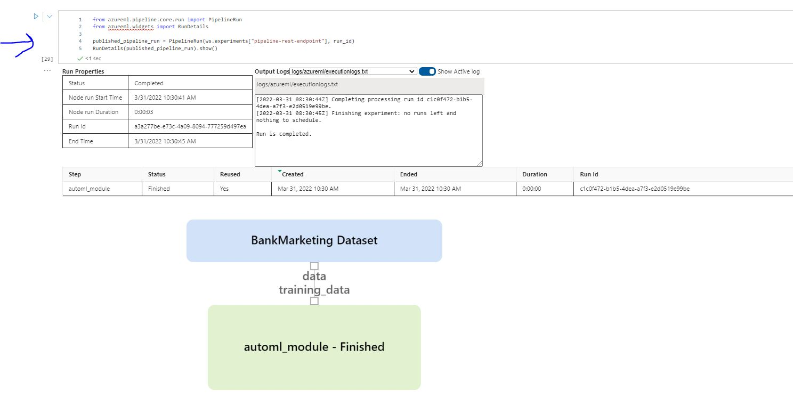

In following image, we can see that : Published Pipeline overview

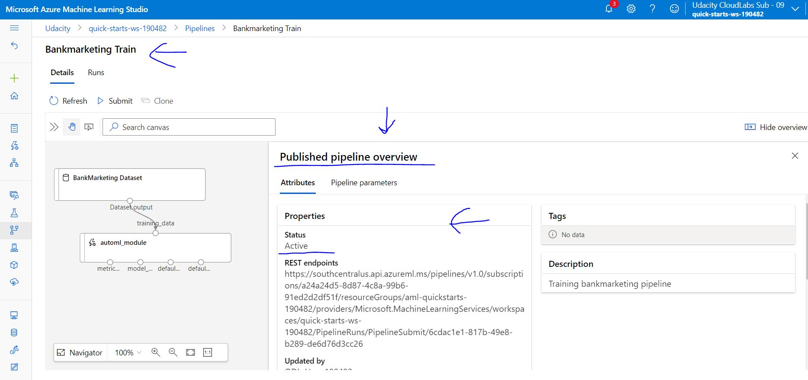

In following image, we can see that : Pipeline consume

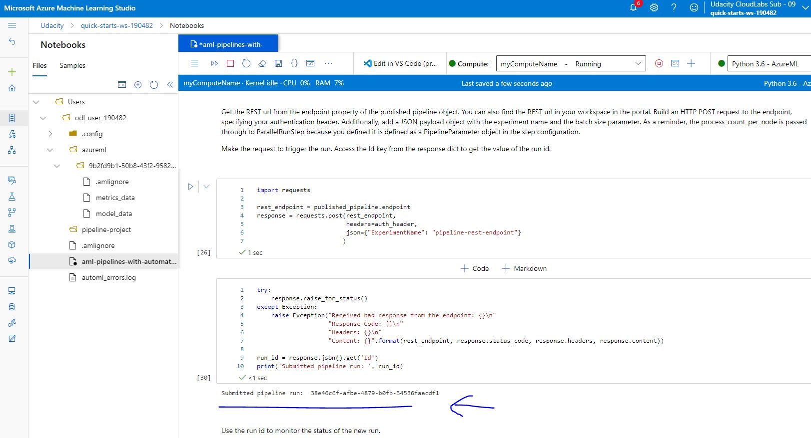

In following image, we can see that : All experiments

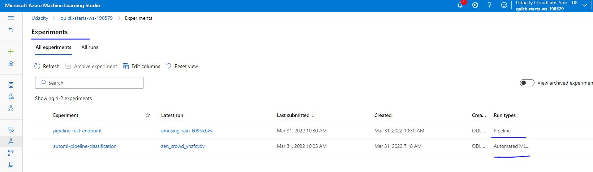

In following image, we can see that : Experiments completed

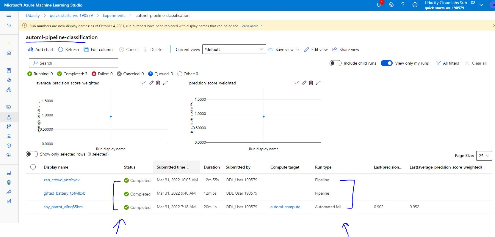

In following image, we can see that : Pipeline experiments completed

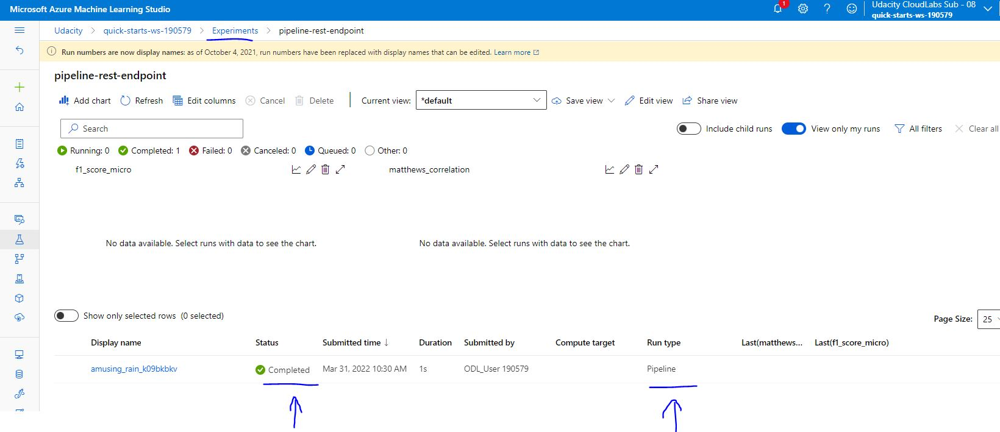

## Screen Recording

Link to a screen recording of the project in action : https://youtu.be/3Yh48B21VeI

The screencast demonstrate:

- Working deployed ML model endpoint
- Deployed Pipeline
- Available AutoML Model
- Successful API requests to the endpoint with a JSON payload

## Standout Suggestions

The following provide information about suggestions :

- Benchmark the endpoint using Apache bench, to load-test model.
- Batch Inference Pipelines : run in parallel.
- Recurring Scheduled Pipelines : to schedule a pipeline.
